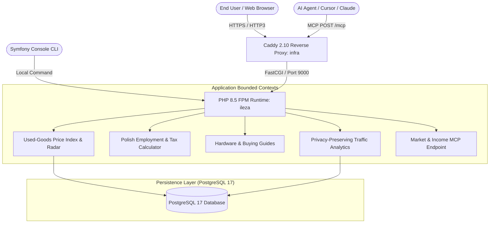

# Architecture Documentation — ileza (ileza.pl)

`ileza` (`ileza.pl`) is the Polish second-hand tech/electronics price radar, financial employment calculator, and editorial fair-price history application.

---

## 1. System Overview & Core Principles



### Architectural Principles

1. **Clean Architecture & Domain-Driven Design (DDD)**
   - Core price calculations, products, and observations are isolated in pure PHP domain entities (`src/Market/Domain/`, `src/Income/Domain/`).
   - Use cases and orchestration are contained in application services (`src/Market/Application/`, `src/Income/Domain/`).
   - Persistence uses Doctrine ORM with an isolated PostgreSQL 17 database and integer `Grosz` Value Objects mapped via a custom DBAL type.
   - External presentation is managed through Symfony controllers and Twig templates (`src/Controller/`, `templates/`).

2. **Editorial Fair-Price Histories (Schema.org Dataset)**
   - The price radar provides manually reviewed editorial fair-price histories rather than algorithmic valuations or scraped listings.
   - Structured data uses Schema.org `Dataset`, `BreadcrumbList`, and `WebPage` (never `Product` or `AggregateOffer`).
   - Observations preload historical snapshots in a single query (`GetProductPriceHistory::preload()`) to eliminate N+1 queries on category and hub pages.

3. **Privacy, Rate Limiting & Anti-Abuse Protection**
   - Price tip submissions and product requests enforce honeypot checks, origin matching, and rate limiting (5 submissions per IP per day).
   - Voluntarily submitted listing URLs have query parameters stripped and are stored privately with a 90-day expiration window.
   - Client IPs and visitor tracking are irreversibly hashed with HMAC-SHA256.

4. **Model Context Protocol (MCP) Integration**
   - Public tools: `list_polish_fair_price_products`, `get_polish_fair_price_product`, `get_polish_fair_price_history`, `calculate_polish_income_comparison`.
   - Admin tools: `get_admin_dashboard_statistics`, `list_admin_contact_leads`, `list_admin_product_requests`, `list_admin_price_tips`, `create_polish_fair_price_product`, `update_polish_fair_price_product`, `delete_polish_fair_price_product`, `update_polish_fair_price_observation`.

---

## 2. Directory Layout

```
ileza/
├── config/                      # Symfony bundle & service configuration
├── migrations/                  # Doctrine database migrations (products, observations, tips, alerts, leads, page_views)
├── public/                      # Static assets (CSS, JS, images, llms.txt)
├── specs/                       # Income calculator and MCP specifications
│   ├── income-calculator.spec.json
│   └── mcp-tools.spec.json
├── src/
│   ├── Analytics/               # Privacy-preserving page view tracking
│   ├── Blog/                    # Hardware buying guides & editorial articles
│   ├── Command/                 # CLI maintenance & alert checking commands
│   │   ├── CheckPriceAlertsCommand.php
│   │   ├── MigrateStorageToDatabaseCommand.php
│   │   └── PruneExpiredDataCommand.php
│   ├── Controller/              # Presentation layer
│   │   ├── Admin/               # MarketAdminController
│   │   ├── BlogController.php   # Editorial guides
│   │   ├── MarketController.php # Price radar, category hubs, product histories
│   │   ├── SitemapController.php# Dynamic XML sitemap
│   │   └── ToolsController.php  # Polish income calculator & legacy redirects
│   ├── Entity/                  # Doctrine ORM entities
│   ├── Income/                  # Polish income & tax calculator
│   │   └── Domain/              # PolishIncomeCalculator (UoP, UZ, UoD, B2B, Spółka z o.o.)
│   ├── Lead/                    # Contact lead capture context
│   ├── Market/                  # Used price index & radar context
│   │   ├── Application/         # Catalog, observation records, price alert orchestration
│   │   ├── Domain/              # Product, PriceObservation, PriceTip, PriceAlert entities
│   │   └── Infrastructure/      # Doctrine repositories
│   ├── Mcp/                     # MCP tool handlers
│   └── Shared/                  # Shared Grosz VO, DBAL type, HTTP helpers
├── templates/                   # Twig templates (market, blog, tools, admin)
├── tests/                       # PHPUnit test suites & spec compliance tests
└── translations/                # Bilingual translations (messages.en.yaml, messages.pl.yaml)
```

---

## 3. Verification & Quality Invariants

All changes must pass the strict verification pipeline:

```bash
docker run --rm -v "$PWD:/app" -w /app/ileza -e APP_ENV=test bahdan-landing-test vendor/bin/phpunit --fail-on-phpunit-notice
docker run --rm -v "$PWD:/app" -w /app/ileza -e APP_ENV=test node:24-alpine sh -lc 'for test in tests/js/*.test.js; do node "$test" || exit 1; done'
docker run --rm -v "$PWD:/app" -w /app/ileza bahdan-landing-test vendor/bin/phpstan analyse --no-progress --memory-limit=512M
docker run --rm -v "$PWD:/app" -w /app/ileza bahdan-landing-test vendor/bin/phpcs
docker run --rm -v "$PWD:/app" -w /app/ileza bahdan-landing-test php bin/console lint:twig templates
docker run --rm -v "$PWD:/app" -w /app/ileza bahdan-landing-test php bin/console lint:yaml translations config
docker run --rm -v "$PWD:/app" -w /app/ileza bahdan-landing-test composer validate --strict --no-check-publish
```
